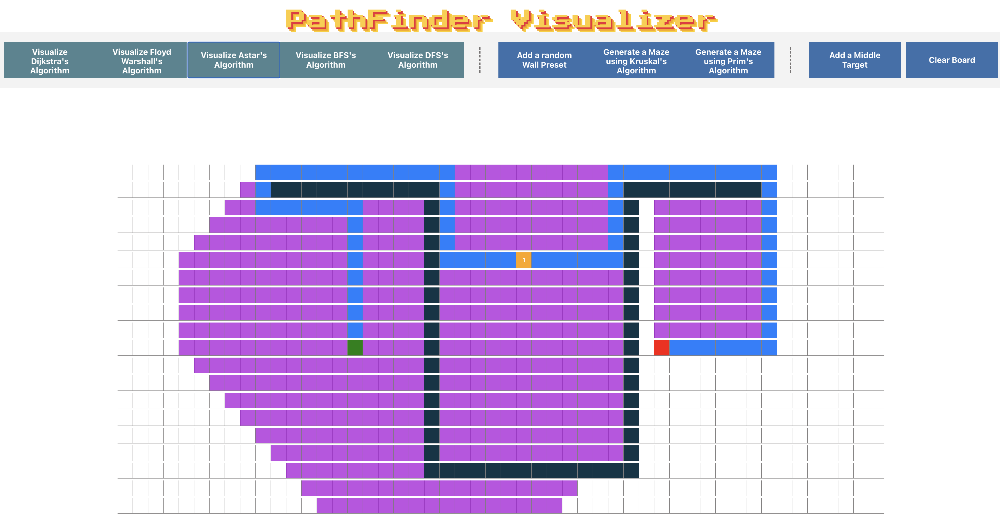

# PathFinder Visualizer

PathFinder Visualizer is an interactive web tool designed to visualize various pathfinding algorithms. This application serves as an educational tool to help users understand and explore the functionality of different algorithms used in pathfinding operations within a grid.

## Features

- **Algorithm Visualization**: Users can visualize how different pathfinding algorithms work, including Dijkstra's, Floyd-Warshall's, A*, BFS (Breadth-First Search), and DFS (Depth-First Search). The visual representation helps in comprehending the algorithm's approach to finding the shortest path.
  
- **Interactive Grid**: The application includes an interactive grid where users can set a start and a finish node to visualize the pathfinding process.

- **Obstacle Creation**: Users have the ability to add obstacles onto the grid, which allows for the simulation of more complex scenarios and demonstrates how algorithms navigate around barriers.

- **Middle Node Inclusion**: The tool supports adding a middle node, offering a more advanced visualization of pathfinding when there is an intermediate checkpoint.

- **Maze Generation**: With Kruskal's and Prim's algorithms, users can automatically generate mazes, which can then be used to visualize how pathfinding algorithms find their way through.

## Goal

The primary goal of PathFinder Visualizer is to make learning about pathfinding algorithms engaging and intuitive. Whether you're a student, educator, or just someone with an interest in algorithms, this visualizer aims to enhance understanding by providing a hands-on, visual approach to these complex concepts.

## Available Scripts

In the project directory, you can run:

### `npm start`

Runs the app in the development mode. 
Open [http://localhost:3000](http://localhost:3000) to view it in the browser.

The page will reload if you make edits. 
You will also see any lint errors in the console.

### `npm test`

Launches the test runner in the interactive watch mode. 
See the section about [running tests](https://facebook.github.io/create-react-app/docs/running-tests) for more information.

### `npm run build`

Builds the app for production to the `build` folder. 
It correctly bundles React in production mode and optimizes the build for the best performance.

